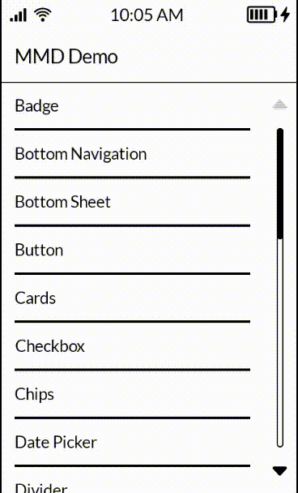

# Mudita Mindful Design (MMD)

A UI component library optimized for E Ink® displays on Android, built on top of Jetpack Compose Material 3 guidelines and classes. Our goal is to provide a consistent, predictable set of components that respects Material Design while addressing the specifics of E Ink® displays.

> We intentionally rely on Material Design (Material 3) classes and patterns. This is by design and a good practice. It keeps us aligned with the Android ecosystem while adapting behavior and styling to E Ink®.

## Why E Ink®?
E Ink® displays differ from standard LCD/OLED:
- slower refresh rates and potential ghosting/afterimage,
- limited color palette (often grayscale),
- great daylight readability with low power consumption,
- animations and visual effects (e.g., ripple) should be minimized; updates should be frugal.

MMD minimizes flicker, reduces unnecessary animations, and simplifies color and typography to make the UI readable and energy‑efficient.

## Features
- **E Ink® optimized**: default color scheme, typography, and interaction patterns for E Ink®.
- **Material Design 3‑based**: integration with `MaterialTheme` and compatibility with M3 components.
- **Ripple disabled**: ripple effects are turned off by default for better UX on E Ink®.
- **Consistent typography**: ready‑to‑use `eInkTypography` and `eInkColorScheme` (monochromatic).
- **Component set**: buttons, text fields, switches, tabs, app bars, and more.

## Setup
```kotlin
dependencies {
    implementation("com.mudita:MMD:${version}")
}
```

## Configuration and theming
Enable the MMD theme in your Compose tree. By default, it applies an E Ink®‑friendly color scheme and typography and disables ripple effects globally.

```kotlin
import com.mudita.mmd.components.buttons.ButtonMMD
import com.mudita.mmd.components.text.TextMMD
import com.mudita.mmd.ThemeMMD

@Composable
fun App() {
    ThemeMMD {
        ButtonMMD(onClick = { /* ... */ }) {
            TextMMD("Hello E Ink®")
        }
    }
}
```

## Using components
MMD works well with both Material 3 components and MMD‑provided components. Use our components where they bring E Ink® optimizations; otherwise, standard M3 components will remain consistent via theming.

```kotlin
import com.mudita.mmd.components.buttons.ButtonMMD
import com.mudita.mmd.components.text.TextMMD

@Composable
fun Screen() {
    ButtonMMD(onClick = { /* ... */ }) {
        TextMMD(text = "Action")
    }
}
```

> Component names may vary by module and version. Explore `com.mudita.mmd.components.*` in your IDE for the full list and API.

## Accessibility and readability
- contrast and font sizes tuned for E Ink®,
- avoid animations/effects that reduce readability,
- utilities to support accessibility (e.g., unified text styles).

## Performance on E Ink® – best practices
- limit animations, auto‑refresh, and fancy transitions,
- avoid frequent state changes leading to redraws,
- prefer monochrome graphics and simple shapes,
- ripple and heavy touch effects are globally disabled by `ThemeMMD`.

## Demo


## Documentation
Full documentation is available here: [📘 Open Documentation](https://zeroheight.com/956ff055a/p/79359a-mudita-mindful-design)

## Contributing
- Please file issues and propose PRs.
- Follow Compose/Material style and code conventions.
- Add tests and usage examples for new components.

## License
Apache License 2.0.

```
Copyright 2025 The Android Open Source Project

Licensed under the Apache License, Version 2.0 (the "License");
you may not use this file except in compliance with the License.
You may obtain a copy of the License at

    http://www.apache.org/licenses/LICENSE-2.0

Unless required by applicable law or agreed to in writing, software
distributed under the License is distributed on an "AS IS" BASIS,
WITHOUT WARRANTIES OR CONDITIONS OF ANY KIND, either express or implied.
See the License for the specific language governing permissions and
limitations under the License.
```
